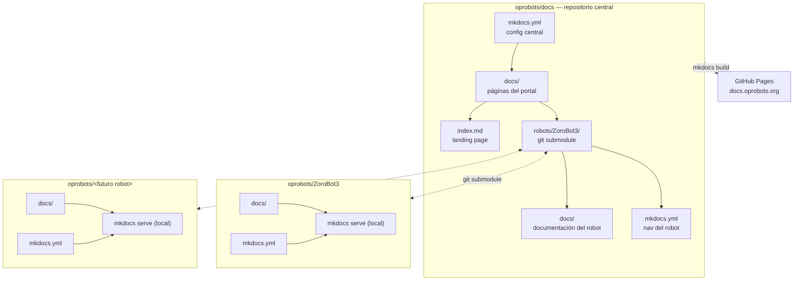

# Portal de Documentación OPRobots

Portal centralizado de documentación técnica del equipo **OPRobots**, construido con [MkDocs](https://www.mkdocs.org/) + [Material for MkDocs](https://squidfunk.github.io/mkdocs-material/) y publicado en GitHub Pages.

🔗 **[https://docs.oprobots.org](https://docs.oprobots.org)**

---

## Arquitectura



**Principio clave**: cada robot mantiene su documentación junto a su código. El repositorio central las agrega con `git submodules` y el plugin [`mkdocs-monorepo-plugin`](https://github.com/backstage/mkdocs-monorepo-plugin). Los robots no necesitan GitHub Actions propias.

---

## Estructura del proyecto

```
oprobots/docs/
├── mkdocs.yml                          # Configuración central de MkDocs
├── requirements.txt                    # Dependencias Python
├── .gitmodules                         # Definición de submodules
├── .github/workflows/deploy.yml        # CI/CD → GitHub Pages
├── docs/                               # Directorio de documentación (docs_dir)
│   ├── index.md                        # Landing page del portal
│   ├── assets/                         # Assets centralizados (tema compartido)
│   │   ├── css/
│   │   │   ├── custom.css              # Estilos OPRobots (colores, tipografía)
│   │   │   └── mermaid-zoom.css        # Lightbox para diagramas Mermaid
│   │   ├── js/
│   │   │   └── mermaid-zoom.js         # Zoom/pan interactivo en diagramas
│   │   ├── templates/
│   │   │   └── main.html               # Template HTML (banner, footer, favicons)
│   │   ├── opr_logo.png                # Logo del equipo
│   │   └── imgs/favicon/               # Favicons multidispositivo
│   ├── robots/
│   │   └── ZoroBot3/                   # ← git submodule (repo completo)
│   │       ├── docs/                   # Documentación técnica (15 capítulos)
│   │       ├── README.md               # Ficha técnica del robot
│   │       └── mkdocs.yml              # Nav del robot (solo usado en local)
└── site/                               # Output del build (gitignored)
```

---

## Uso local

### Requisitos

- Python 3.x
- Git (con soporte para submodules)

### Primer clone

```bash
# Clonar con submodules
git clone --recurse-submodules git@github.com:OPRobots/docs.git
cd docs

# Instalar dependencias
pip install -r requirements.txt

# Servir el portal completo (incluye docs de ZoroBot3)
mkdocs serve
```

Abre [http://127.0.0.1:8000](http://127.0.0.1:8000) en el navegador.

### Actualizar docs de los robots

```bash
# Traer la última versión de la documentación de todos los robots
git submodule update --remote --recursive

# Reconstruir
mkdocs build
```

### Trabajar en un robot individual

Cada robot tiene su propio `mkdocs.yml` y puede servirse de forma independiente:

```bash
cd docs/robots/ZoroBot3
mkdocs serve          # Solo la documentación de ZoroBot3
```

Esto permite a los desarrolladores de cada robot probar sus cambios localmente sin necesidad del portal completo.

---

## Añadir un nuevo robot

### Paso 1: Añadir el submodule

```bash
# Desde la raíz del repositorio docs
git submodule add -b main https://github.com/OPRobots/NuevoRobot.git docs/robots/NuevoRobot
```

El robot debe tener una carpeta `docs/` con su documentación y un `mkdocs.yml` propio.

### Paso 2: Registrar en la navegación

Editar `mkdocs.yml` y añadir al `nav`:

```yaml
nav:
  - Inicio: index.md
  - Robots:
      - ZoroBot3: '!include docs/robots/ZoroBot3/mkdocs.yml'
      - NuevoRobot: '!include docs/robots/NuevoRobot/mkdocs.yml'  # ← añadir
```

> La ruta es relativa al `mkdocs.yml` central (la raíz del repositorio).  
> El `!include` va como **valor directo** (no como elemento de lista) para evitar un nivel extra en la navegación.

### Paso 3: Actualizar el catálogo

Editar `docs/robots/index.md` y añadir una entrada para el nuevo robot:

```markdown
- **[NuevoRobot](NuevoRobot/)** — Descripción breve del robot y sus características.
```

### Paso 4: Verificar

```bash
git submodule update --remote --recursive
mkdocs build
```

### Paso 5: Commit y push

```bash
git add .gitmodules docs/robots/NuevoRobot mkdocs.yml docs/robots/index.md
git commit -m "Añade submodule NuevoRobot"
git push
```

El deploy se ejecutará automáticamente en el siguiente push a `main`.

---

## Deploy

El deploy se realiza mediante **GitHub Actions** (`.github/workflows/deploy.yml`).

### Disparadores

| Evento | Descripción |
|--------|-------------|
| Push a `main` | Cada cambio en el portal se publica automáticamente |
| Pull Request a `main` | Se ejecuta el build (sin deploy) para validar |
| Cron diario (`0 0 * * *`) | Reconstruye cada día para reflejar cambios en los robots upstream |
| `workflow_dispatch` | Ejecución manual desde la pestaña Actions de GitHub |

### Flujo del workflow

1. **Checkout** del repositorio con submodules recursivos
2. **Update submodules** (`git submodule update --remote --recursive`) para traer la última versión de las docs de cada robot
3. **Setup Python** 3.x
4. **Instalar dependencias** (`pip install -r requirements.txt`)
5. **Build** (`mkdocs build`) — genera `site/`
6. **Upload artifact** (`actions/upload-pages-artifact@v3`) — sube `site/` como artefacto de Pages
7. **Deploy** (`actions/deploy-pages@v4`) — publica en GitHub Pages (solo en `main`)

### Configuración en GitHub

En el repositorio `OPRobots/docs`, ir a:

```
Settings → Pages → Source: GitHub Actions
```

El dominio `docs.oprobots.org` se configura en el mismo apartado (Custom domain).

---

## DNS

Para que `docs.oprobots.org` funcione, añadir en el proveedor de DNS:

```dns
docs    CNAME    oprobots.github.io
```

GitHub Pages se encarga de servir el contenido en ese dominio una vez configurado el custom domain en Settings → Pages.

---

## Dependencias

| Paquete | Versión mínima | Uso |
|---------|---------------|-----|
| `mkdocs` | ≥1.6 | Framework de documentación |
| `mkdocs-material` | ≥9.5 | Tema visual (Material Design) |
| `mkdocs-monorepo-plugin` | ≥1.1 | Fusión de navegación desde múltiples proyectos MkDocs |

Instalación: `pip install -r requirements.txt`

---

## Notas técnicas

### Plugin monorepo

El `mkdocs-monorepo-plugin` usa la sintaxis `!include` para incluir proyectos MkDocs externos:

```yaml
# En el nav del mkdocs.yml central:
- ZoroBot3: '!include docs/robots/ZoroBot3/mkdocs.yml'
```

La ruta es relativa al `mkdocs.yml` central (la raíz del repositorio).

El plugin:
- Lee el `mkdocs.yml` del robot hijo y extrae su `nav`
- Fusiona **solo el `nav`** en la navegación central, sin modificar el robot original
- **No fusiona**: `theme`, `extra_css`, `extra_javascript`, `markdown_extensions`, `custom_dir`, ni `plugins` del hijo

Por eso todos los assets visuales (CSS, JS, favicons, template) están **centralizados** en `docs/assets/` y configurados en el `mkdocs.yml` raíz.

### Assets centralizados

Los assets se migraron desde ZoroBot3 al portal central:
- `custom.css` — paleta de colores OPRobots (modo claro/oscuro), tipografía Roboto Slab
- `mermaid-zoom.css` + `mermaid-zoom.js` — lightbox interactivo para diagramas (zoom, pan, overlay)
- `main.html` — template Jinja2 con banner "Volver a OPRobots.org", footer personalizado, favicons, y el parche `attachShadow` necesario para el zoom de Mermaid

### Validación de enlaces

```yaml
validation:
  links:
    not_found: ignore
```

La validación de enlaces rotos está en `ignore` porque el monorepo plugin puede generar falsos positivos al resolver rutas entre documentos de distintos proyectos. Los enlaces realmente rotos se detectan navegando el sitio.

### Submodules vs clone-in-CI

Actualmente se usan **git submodules** por simplicidad. En el futuro, cuando haya más robots, se puede migrar a un enfoque de clone-in-CI donde el workflow clona solo las carpetas `docs/` de cada repositorio, evitando descargar código fuente, PCBs y modelos 3D innecesarios para la documentación.

---

## Robots integrados

| Robot | Repositorio | Documentación |
|-------|-------------|---------------|
| FujitoraBot2 | [OPRobots/FujitoraBot2](https://github.com/OPRobots/FujitoraBot2) | 13 capítulos: hardware, software, sensores, movimiento, PID, menú, debug, calibración, EEPROM, encoders, batería, cinemática, problemas conocidos |
| ZoroBot3 | [OPRobots/ZoroBot3](https://github.com/OPRobots/ZoroBot3) | 15 capítulos: hardware, software, sensores, movimiento, floodfill, PID, menú, debug, calibración, EEPROM, encoders, batería, simulador, cinemática, problemas conocidos |

---

Visita la web del equipo: **[oprobots.org](https://oprobots.org)**
